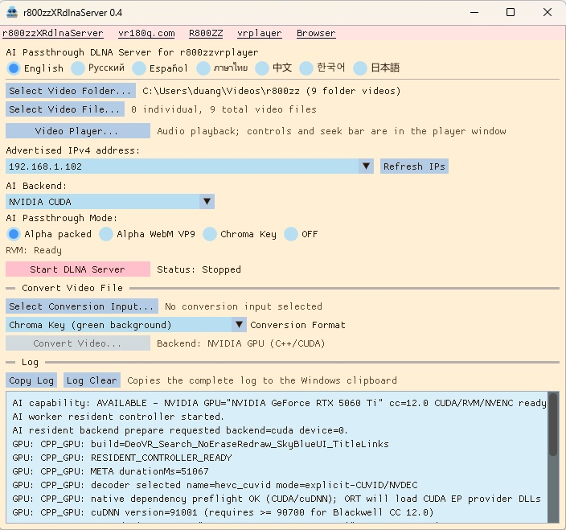

# r800zzXRdlnaServer for Windows

[English](README.md) | [Русский](README_ru.md) | [Español](README_es.md) | [ภาษาไทย](README_th.md) | [中文](README_zh.md) | [한국어](README_ko.md) | [日本語](README_ja.md)

## Ver 0.4 : Fixed a bug that limited support to certain NVIDIA GPUs.
## Ver 0.4 : Added support for non-NVIDIA GPUs via DirectML.

A Windows DLNA server for XR video playback on PICO, Meta Quest, and other compatible devices, featuring real-time AI background removal (RVM), alpha/chroma-key output, and video conversion.

**A fast GPU is required for real-time AI passthrough.**

`r800zzXRdlnaServer` is a native C++ application. It uses the FFmpeg libraries directly and does not launch Python or `ffmpeg.exe`.

## Download

https://github.com/r800zz/r800zzxrdlnaserver/releases/latest

<a href="./jpeg/server_en.jpeg" target="_blank">
  
</a>

### VR video players supporting the output

For Green-screen MP4, examples of VR players with chroma-key functionality include:

- [R800ZZbrowser for PICO/Meta](https://vr180g.com/browser/browser.php?l=en)
- [r800zzvrplayer for PICO/Meta](https://vr180g.com/pico/vrplayer.php?l=en)

For Alpha Packed (DeoVR alpha video format):

- [r800zzvrplayer for PICO/Meta](https://vr180g.com/pico/vrplayer.php?l=en)
- DeoVR (Non-VR videos are not supported.)

For WebM VP9 Alpha, the VR player I have confirmed is:

- **[r800zzvrplayer 0.6 or later](https://vr180g.com/pico/vrplayer.php?l=en)**

## Features

- Serves a selected video folder and individually selected video files through DLNA.
- Preserves the exact source filename in the DLNA media list.
- Provides UPnP/DLNA discovery and ContentDirectory support for compatible clients, including DeoVR.
- Removes video backgrounds in real time with Robust Video Matting (RVM).
- Supports Alpha Packed, genuine WebM VP9 alpha, and green chroma-key output.
- Supports NVIDIA CUDA, DirectML, and CPU AI backends.
- DirectML enables GPU processing on compatible AMD, Intel, and NVIDIA GPUs.
- Includes offline video conversion with GPU acceleration and a CPU fallback.
- Includes a simple Windows video player with audio, seeking, pause/resume, fullscreen, and SBS left-half display.
- Provides English, Russian, Spanish, Thai, Chinese, Korean, and Japanese interfaces.
- Stores per-user settings under `%LOCALAPPDATA%`, not in the installation directory.

## DLNA Output Modes

| Mode | Output | Notes |
| --- | --- | --- |
| Alpha Packed | HEVC in MPEG-TS | Fast real-time mode for compatible XR players. |
| Alpha WebM VP9 | WebM with genuine VP9 alpha | Uses CPU-based libvpx encoding and may drop frames, especially with 4K/60 video. |
| Chroma Key | HEVC with a green background | Use a green chroma-key mode in the receiving player. |
| OFF | Original source file | No RVM processing and no fast GPU is required. |

Alpha interpretation depends on the receiving player. A client that does not support the selected alpha format may display an opaque image.

## System Requirements

### Prebuilt release

- Windows 10 or Windows 11, 64-bit
- A private local network shared by the Windows PC and the playback device
- A compatible DLNA video player
- A sufficiently fast GPU for real-time AI modes
- A current graphics driver for the selected GPU

Available AI backends:

- **NVIDIA CUDA**: optimized path for supported NVIDIA GPUs.
- **DirectML**: GPU path for compatible AMD, Intel, and NVIDIA GPUs.
- **CPU**: fallback path; real-time performance is not guaranteed.

The prebuilt package contains the required application runtime components. A separate CUDA Toolkit installation is not required for normal use of the packaged application.

For the NVIDIA CUDA backend, a compatible NVIDIA display driver is required. For DirectML, use a current Windows graphics driver that supports the GPU.

If the selected GPU is not fast enough for real-time AI processing:

- Normal DLNA delivery remains available in `OFF` mode.
- Offline RVM conversion can use another GPU backend or the FP32 ONNX model through the CPU backend.
- Real-time AI modes may run below the source frame rate.

## Installation

1. Download the latest Windows x64 installer from the repository's **Releases** page.
2. Run the installer.
3. Start `r800zzXRdlnaServer`.
4. If Windows Firewall asks for permission, allow access on **Private networks**.

The installer is relatively large because it includes ONNX Runtime GPU support, DirectML, CUDA/cuDNN runtime components for the NVIDIA backend, FFmpeg libraries, and the RVM models.

## Basic DLNA Use

1. Select a folder with **Select Video Folder...**, add individual files with **Select Video File...**, or use both.
2. Select an AI backend:
   - **NVIDIA CUDA**
   - **DirectML**
   - **CPU**
3. Select an output mode:
   - **Alpha Packed**
   - **Alpha WebM VP9**
   - **Chroma Key**
   - **OFF**
4. When using DirectML, select the GPU adapter to use.
5. Confirm the advertised IPv4 address.
6. Select **Start DLNA Server**.
7. Open a compatible DLNA player on the same local network.
8. Select `r800zzXRdlnaServer` and choose a video.

The server log shows DLNA discovery, description requests, media-list requests, playback requests, and worker errors. **Log Clear** clears the displayed log.

## Video Conversion

The integrated converter can create:

- Chroma-key MP4
- Alpha WebM VP9
- Alpha Packed MP4

The suggested output filename includes the conversion start time:

```text
movie_RVM_ChromaKey_202609210542.mp4
```

Conversion progress is shown as an output-frame count. The converter first writes to an internal partial file and publishes the requested output filename only after the encoder and container finish successfully. A conversion log is saved beside the output file.

RVM processing can use NVIDIA CUDA, DirectML, or CPU depending on the selected backend and available hardware. The NVIDIA CUDA path can use NVDEC and NVENC where applicable. DirectML provides GPU inference on compatible non-NVIDIA and NVIDIA GPUs. The CPU backend remains available as a fallback.

## Integrated Video Player

**Video Player...** opens a local video independently of the DLNA selection.

Controls include:

- Play/Pause
- Seek bar
- Current and total time
- Fullscreen toggle
- SBS left-half display
- Space: Play/Pause
- Left/Right Arrow: Seek five seconds
- Escape: Leave fullscreen or close the player

The player attempts NVIDIA NVDEC for supported codecs when available and falls back to software decoding when necessary. NVIDIA hardware is not required to use the player.

## Audio Handling

- `OFF` mode sends the original file unchanged; the receiving player handles its audio codec.
- Alpha Packed and Chroma Key MPEG-TS output use AAC audio.
- Alpha WebM VP9 output uses Opus audio.
- Other FFmpeg-decodable source audio can be transcoded when required.
- Multichannel input is downmixed to stereo; mono input remains mono.

## Building from Source

### Requirements

- Windows 10 or Windows 11, 64-bit
- Visual Studio 2022 with **Desktop development with C++**
- CMake 3.24 or later
- NVIDIA CUDA Toolkit 12.8 to compile the CUDA backend
- Internet access while downloading the build dependencies

The CUDA Toolkit is a build dependency for the NVIDIA CUDA backend. The finished application can also run its AI processing through DirectML on compatible non-NVIDIA GPUs.

### Build

Open a Command Prompt in the repository root and run:

```bat
setup_dependencies.bat
build.bat
```

`setup_dependencies.bat` downloads the pinned development dependencies and official RVM ONNX models. `build.bat` configures and builds the project with CMake and NMake.

The generated files are placed in:

```text
build_cuda_ep\bin\r800zz_dlna_server.exe
build_cuda_ep\bin\r800zz_ai_worker.exe
build_cuda_ep\bin\rvm_mobilenetv3_fp16.onnx
build_cuda_ep\bin\rvm_mobilenetv3_fp32.onnx
```

The current build pins the FFmpeg shared package to `N-124714-g49a77d37be`. Do not replace the pinned package with a floating latest build without checking the relevant driver and hardware-encoding API requirements.

## Implementation

The application provides three AI backends:

- **NVIDIA CUDA** for supported NVIDIA GPUs.
- **DirectML** for compatible Windows GPUs, including AMD, Intel, and NVIDIA.
- **CPU** as a compatibility fallback.

The optimized NVIDIA real-time path is:

```text
FFmpeg NVDEC
    -> CUDA preprocessing
    -> ONNX Runtime CUDA EP / RVM
    -> CUDA alpha packing or chroma-key composition
    -> FFmpeg NVENC
    -> MPEG-TS / DLNA
```

When DirectML is selected, RVM inference runs through the DirectML execution path on the selected compatible GPU. CUDA, NVDEC, and NVENC optimizations remain specific to NVIDIA hardware.

WebM VP9 alpha uses `libvpx-vp9` CPU encoding because the application does not rely on a vendor-specific VP9 hardware encoder for this output mode.

FFmpeg is used through its C libraries and shared DLLs:

- `avformat`
- `avcodec`
- `avutil`
- `swresample`
- `swscale`

## Known Limitations

- Real-time AI performance depends heavily on GPU speed, video resolution, frame rate, and selected backend.
- WebM VP9 alpha encoding is CPU-intensive and may not maintain the source frame rate.
- Alpha and chroma-key support varies between DLNA/XR players.
- The application currently targets Windows x64.

## Third-Party Components

This project uses:

- [Robust Video Matting](https://github.com/PeterL1n/RobustVideoMatting)
- [FFmpeg](https://ffmpeg.org/)
- [ONNX Runtime](https://github.com/microsoft/onnxruntime)
- [DirectML](https://github.com/microsoft/DirectML)
- [Dear ImGui](https://github.com/ocornut/imgui)
- [NVIDIA CUDA Toolkit](https://developer.nvidia.com/cuda-toolkit)
- [NVIDIA cuDNN](https://developer.nvidia.com/cudnn)

NVIDIA CUDA/cuDNN components are used by the NVIDIA backend; their presence does not mean that an NVIDIA GPU is required for the DirectML backend.

Each third-party component remains subject to its own license and redistribution terms.

## License

This project is distributed under the **GNU General Public License v3.0**. See [LICENSE](LICENSE).

The RVM model and RVM-derived components are also subject to the upstream Robust Video Matting license. Source distributions and binary releases must retain all applicable copyright and license notices.

## Links

- [vr180g.com](https://vr180g.com/)
- [R800ZZ on YouTube](https://www.youtube.com/@R800ZZ)
