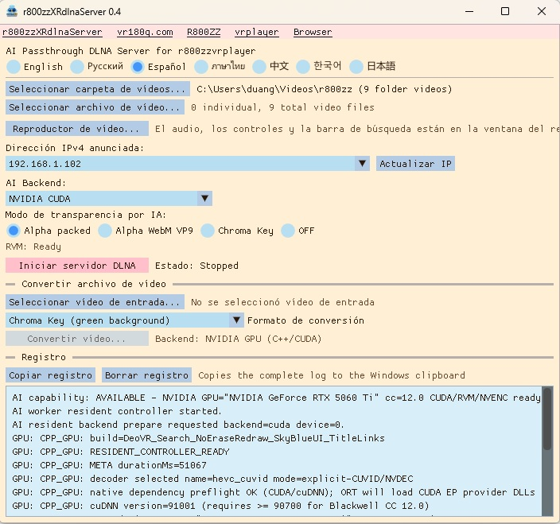
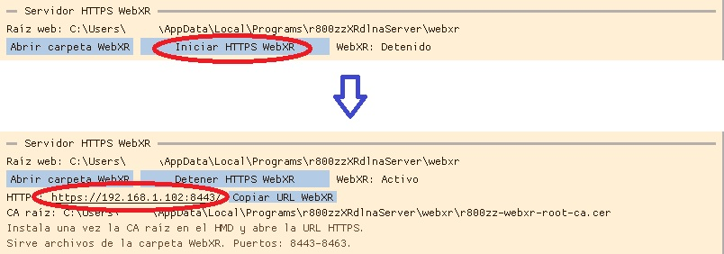

# r800zzXRdlnaServer for Windows

[English](README.md) | [Русский](README_ru.md) | [Español](README_es.md) | [ภาษาไทย](README_th.md) | [中文](README_zh.md) | [한국어](README_ko.md) | [日本語](README_ja.md)

### Ver 0.5 : Se añadió un servidor HTTPS WebXR. (Puedes jugar a juegos WebXR almacenados en tu PC.)
### Ver 0.5 : Se añadió compatibilidad con la navegación jerárquica de carpetas en DLNA.
### Ver 0.5 : Se añadió la selección de GPU para la conversión de archivos con IA.
### Ver 0.5 : Se mejoró la gestión de GPU en el reproductor de vídeo.
### Ver 0.4 : Se corrigió un error que limitaba la compatibilidad a determinadas GPU NVIDIA.
### Ver 0.4 : Se añadió compatibilidad con GPU que no son NVIDIA mediante DirectML.

Servidor DLNA para Windows destinado a la reproducción de vídeo XR en PICO, Meta Quest y otros dispositivos compatibles, con eliminación de fondo mediante IA en tiempo real (RVM), salida alfa/croma y conversión de vídeo.

**Se requiere una GPU rápida para AI Passthrough en tiempo real.**

`r800zzXRdlnaServer` es una aplicación nativa de C++. Usa directamente las bibliotecas FFmpeg y no ejecuta Python ni `ffmpeg.exe`.

## Descarga

https://github.com/r800zz/r800zzxrdlnaserver/releases/latest

<a href="./jpeg/server_es.jpeg" target="_blank">
  
</a>

## Servidor HTTPS WebXR

<a href="./jpeg/webxrserver_es.jpeg" target="_blank">
  
</a>  

<a href="./jpeg/webxr_demo.jpeg" target="_blank">
  
</a>

### Reproductores de vídeo VR compatibles con la salida

Para MP4 con pantalla verde:

- [R800ZZbrowser para PICO/Meta](https://vr180g.com/browser/browser.php?l=es)
- [r800zzvrplayer para PICO/Meta](https://vr180g.com/pico/vrplayer.php?l=es)

Para Alpha Packed:

- [r800zzvrplayer para PICO/Meta](https://vr180g.com/pico/vrplayer.php?l=es)
- DeoVR (No admite vídeos que no sean VR.)

Para WebM VP9 Alpha:

- **[r800zzvrplayer 0.6 o posterior](https://vr180g.com/pico/vrplayer.php?l=es)**

## Emulación de archivos en el modo AI

La conversión mediante AI en tiempo real se transmite como un flujo en directo en lugar de como un archivo.  
Al tratarse de un flujo en directo, no sería posible buscar una posición arbitraria del vídeo sin un tratamiento especial.  
En una transmisión en directo, los datos futuros todavía no se han generado, por lo que tampoco se conoce la duración total del vídeo.  
No poder realizar búsquedas resulta inconveniente.  
No conocer la duración del vídeo también resulta inconveniente.  
Por este motivo, el reproductor r800zzvrplayer utiliza emulación de archivos para que el flujo pueda tratarse como un archivo normal, permitiendo realizar búsquedas y mostrar la duración del vídeo.  
Esta emulación de archivos optimizada fue posible porque el servidor DLNA y el reproductor de vídeo fueron desarrollados por el mismo desarrollador.  
r800zzvrplayer dispone de un modo de comunicación especial con r800zzXRdlnaServer que permite un funcionamiento optimizado entre ambas aplicaciones.  
También se ha implementado emulación de archivos para DeoVR, pero como toda la compatibilidad debe gestionarse desde el servidor, la optimización resulta más difícil.  
Como resultado, los tiempos de respuesta son más largos con DeoVR.

## Funciones

- Sirve mediante DLNA una carpeta de vídeos y archivos seleccionados individualmente.
- Conserva el nombre exacto del archivo de origen en la lista DLNA.
- Proporciona UPnP/DLNA y ContentDirectory para clientes compatibles, incluido DeoVR.
- Elimina fondos en tiempo real con Robust Video Matting (RVM).
- Admite Alpha Packed, WebM VP9 alpha auténtico y croma verde.
- Admite los backends de IA NVIDIA CUDA, DirectML y CPU.
- DirectML permite procesamiento por GPU en hardware compatible de AMD, Intel y NVIDIA.
- Incluye conversión sin conexión con aceleración por GPU y alternativa por CPU.
- Incluye un reproductor de vídeo para Windows con audio, búsqueda, pausa/reanudación, pantalla completa y mitad izquierda SBS.
- Interfaces en inglés, ruso, español, tailandés, chino, coreano y japonés.
- Guarda la configuración en `%LOCALAPPDATA%`.

## Modos de salida DLNA

| Modo | Salida | Notas |
| --- | --- | --- |
| Alpha Packed | HEVC en MPEG-TS | Modo rápido en tiempo real para reproductores XR compatibles. |
| Alpha WebM VP9 | WebM con alpha VP9 auténtico | Usa libvpx por CPU y puede perder fotogramas, especialmente con 4K/60. |
| Chroma Key | HEVC con fondo verde | Use el modo de croma verde en el reproductor receptor. |
| OFF | Archivo original | No realiza RVM y no requiere una GPU rápida. |

## Requisitos del sistema

### Versión precompilada

- Windows 10 o Windows 11 de 64 bits
- Red local privada compartida por el PC y el dispositivo de reproducción
- Reproductor DLNA compatible
- GPU suficientemente rápida para los modos de IA en tiempo real
- Controlador gráfico actualizado para la GPU seleccionada

Backends de IA disponibles:

- **NVIDIA CUDA**: ruta optimizada para GPU NVIDIA compatibles.
- **DirectML**: ruta GPU para hardware compatible de AMD, Intel y NVIDIA.
- **CPU**: alternativa; no se garantiza rendimiento en tiempo real.

El paquete precompilado contiene los componentes necesarios. No es necesario instalar CUDA Toolkit por separado para usar la aplicación.

El backend NVIDIA CUDA requiere un controlador NVIDIA compatible. Para DirectML, use un controlador de Windows actualizado compatible con la GPU.

Si la GPU no es suficientemente rápida:

- `OFF` sigue disponible.
- La conversión RVM puede usar otro backend GPU o el modelo FP32 ONNX mediante CPU.
- Los modos de IA pueden funcionar por debajo de la frecuencia de fotogramas original.

## Instalación

1. Descargue el instalador Windows x64 más reciente desde **Releases**.
2. Ejecute el instalador.
3. Inicie `r800zzXRdlnaServer`.
4. Si Windows Firewall lo solicita, permita acceso en **redes privadas**.

El instalador incluye soporte GPU de ONNX Runtime, DirectML, componentes CUDA/cuDNN para el backend NVIDIA, bibliotecas FFmpeg y modelos RVM.

## Uso básico de DLNA

1. Seleccione una carpeta y/o archivos individuales.
2. Seleccione el backend:
   - **NVIDIA CUDA**
   - **DirectML**
   - **CPU**
3. Seleccione el modo:
   - **Alpha Packed**
   - **Alpha WebM VP9**
   - **Chroma Key**
   - **OFF**
4. Con DirectML, seleccione el adaptador GPU.
5. Confirme la dirección IPv4.
6. Inicie el servidor DLNA.
7. Abra un reproductor compatible en la misma red.
8. Seleccione `r800zzXRdlnaServer` y un vídeo.

## Conversión de vídeo

Puede crear:

- MP4 con croma
- Alpha WebM VP9
- Alpha Packed MP4

```text
movie_RVM_ChromaKey_202609210542.mp4
```

RVM puede usar NVIDIA CUDA, DirectML o CPU. La ruta NVIDIA CUDA puede usar NVDEC/NVENC cuando corresponda. DirectML permite inferencia GPU en hardware compatible de NVIDIA y de otros fabricantes. CPU permanece como alternativa.

## Reproductor de vídeo integrado

**Reproductor de vídeo...** abre un vídeo local independientemente de DLNA.

- Reproducir/Pausa
- Barra de búsqueda
- Tiempo actual/total
- Pantalla completa
- Mitad izquierda SBS
- Space: Reproducir/Pausa
- Flechas izquierda/derecha: cinco segundos
- Escape: salir de pantalla completa o cerrar

El reproductor intenta usar NVIDIA NVDEC cuando está disponible y vuelve a decodificación por software cuando es necesario. No se requiere una GPU NVIDIA para usar el reproductor.

## Audio

- `OFF` envía el archivo original.
- Alpha Packed y Chroma Key usan AAC.
- Alpha WebM VP9 usa Opus.
- Otros formatos compatibles con FFmpeg pueden transcodificarse.
- Audio multicanal se mezcla a estéreo; mono permanece mono.

## Compilación desde código fuente

### Requisitos

- Windows 10/11 de 64 bits
- Visual Studio 2022 con **Desktop development with C++**
- CMake 3.24 o posterior
- NVIDIA CUDA Toolkit 12.8 para compilar el backend CUDA
- Acceso a Internet

CUDA Toolkit es una dependencia de compilación del backend NVIDIA CUDA. La aplicación terminada también puede ejecutar IA mediante DirectML en GPU compatibles que no sean NVIDIA.

### Compilación

```bat
setup_dependencies.bat
build.bat
```

Archivos generados:

```text
build_cuda_ep\bin\r800zz_dlna_server.exe
build_cuda_ep\bin\r800zz_ai_worker.exe
build_cuda_ep\bin\rvm_mobilenetv3_fp16.onnx
build_cuda_ep\bin\rvm_mobilenetv3_fp32.onnx
```

## Implementación

Backends:

- **NVIDIA CUDA**
- **DirectML** para GPU compatibles de AMD, Intel y NVIDIA
- **CPU**

Ruta NVIDIA optimizada:

```text
FFmpeg NVDEC
    -> CUDA preprocessing
    -> ONNX Runtime CUDA EP / RVM
    -> CUDA alpha packing or chroma-key composition
    -> FFmpeg NVENC
    -> MPEG-TS / DLNA
```

Con DirectML, la inferencia RVM se ejecuta en la GPU compatible seleccionada. CUDA, NVDEC y NVENC siguen siendo específicos de NVIDIA.

WebM VP9 alpha usa codificación CPU `libvpx-vp9`.

## Limitaciones conocidas

- El rendimiento en tiempo real depende mucho de la GPU, resolución, FPS y backend.
- WebM VP9 alpha consume mucha CPU.
- La compatibilidad alpha/croma varía según el reproductor.
- La aplicación está destinada a Windows x64.

## Componentes de terceros

- [Robust Video Matting](https://github.com/PeterL1n/RobustVideoMatting)
- [FFmpeg](https://ffmpeg.org/)
- [ONNX Runtime](https://github.com/microsoft/onnxruntime)
- [DirectML](https://github.com/microsoft/DirectML)
- [Dear ImGui](https://github.com/ocornut/imgui)
- [NVIDIA CUDA Toolkit](https://developer.nvidia.com/cuda-toolkit)
- [NVIDIA cuDNN](https://developer.nvidia.com/cudnn)

Los componentes NVIDIA CUDA/cuDNN pertenecen al backend NVIDIA y no significan que DirectML requiera una GPU NVIDIA.

## Licencia

Este proyecto se distribuye bajo **GNU General Public License v3.0**. Consulte [LICENSE](LICENSE).

## Enlaces

- [vr180g.com](https://vr180g.com/)
- [R800ZZ en YouTube](https://www.youtube.com/@R800ZZ)
