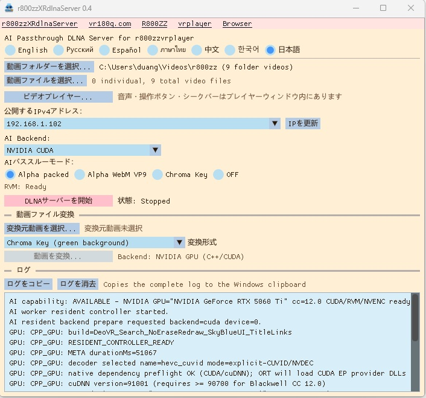

# r800zzXRdlnaServer for Windows

[English](README.md) | [Русский](README_ru.md) | [Español](README_es.md) | [ภาษาไทย](README_th.md) | [中文](README_zh.md) | [한국어](README_ko.md) | [日本語](README_ja.md)

### Ver 0.5 : WebXR HTTPSサーバーを追加しました。（PCに保存したWebXRゲームをプレイできます。）
### Ver 0.5 : DLNAの階層ディレクトリ閲覧に対応しました。
### Ver 0.5 : AIファイル変換のGPU選択に対応しました。
### Ver 0.5 : 動画プレイヤーのGPU処理を改善しました。
### Ver 0.4 : NVIDIAであっても対応GPUが限定されるバグを修正しました。
### Ver 0.4 : NVIDIA以外のGPUもDirectML経由で対応しました。

PICO、Meta Quest、その他の互換デバイスでXR動画を再生するためのWindows用DLNAサーバーです。リアルタイムAI背景除去（RVM）、アルファ／クロマキー出力、動画変換に対応しています。

**リアルタイムAIパススルーには高速なGPUが必要です。**

`r800zzXRdlnaServer` はネイティブC++アプリケーションです。FFmpegライブラリを直接使用し、Pythonや`ffmpeg.exe`は起動しません。

## ダウンロード

https://github.com/r800zz/r800zzxrdlnaserver/releases/latest

<a href="./jpeg/server_ja.jpeg" target="_blank">
  
</a>

### 出力に対応するVR動画プレイヤー

Green-screen MP4のクロマキー再生例:

- [R800ZZbrowser for PICO/Meta](https://vr180g.com/browser/browser.php?l=jp)
- [r800zzvrplayer for PICO/Meta](https://vr180g.com/pico/vrplayer.php?l=jp)

Alpha Packed（DeoVR alpha video format）:

- [r800zzvrplayer for PICO/Meta](https://vr180g.com/pico/vrplayer.php?l=jp)
- DeoVR（非VR動画は対応していません。）

WebM VP9 Alphaで確認済みのVRプレイヤー:

- **[r800zzvrplayer 0.6以降](https://vr180g.com/pico/vrplayer.php?l=jp)**

## AIモードでのファイルエミュレーション

リアルタイムAI変換は、ファイルではなくライブストリームとして配信されます。  
ライブストリームであるため、特別な処理を行わなければ動画内の任意の位置へシークすることはできません。  
ライブストリームでは未来のデータがまだ生成されていないため、動画全体の長さも分かりません。  
シークできないのは不便です。  
動画の長さが分からないことも不便です。  
そのため、動画プレイヤーのr800zzvrplayerではファイルエミュレーションを使用し、ストリームを通常のファイルのように扱うことで、シークと動画長の表示を可能にしています。  
この最適化されたファイルエミュレーションを実現できたのは、DLNAサーバーと動画プレイヤーを同じ開発者が開発しているためです。  
r800zzvrplayerにはr800zzXRdlnaServerとの特別な通信モードがあり、2つのアプリケーション間で最適化された動作が可能です。  
DeoVR向けのファイルエミュレーションも実装していますが、互換性のための処理をすべてサーバー側で行う必要があるため、最適化はより困難です。  
その結果、DeoVRでは応答時間が長くなります。

## 機能

- 選択した動画フォルダーと個別選択した動画ファイルをDLNAで配信します。
- DLNAメディア一覧で元ファイル名をそのまま保持します。
- DeoVRを含む互換クライアント向けのUPnP/DLNA discoveryとContentDirectoryに対応します。
- Robust Video Matting（RVM）で動画背景をリアルタイム除去します。
- Alpha Packed、真正なWebM VP9 alpha、Green chroma-key出力に対応します。
- NVIDIA CUDA、DirectML、CPUのAIバックエンドに対応します。
- DirectMLにより、対応するAMD、Intel、NVIDIA GPUでGPU処理できます。
- GPUアクセラレーションとCPUフォールバックを備えたオフライン動画変換に対応します。
- 音声、シーク、一時停止／再開、全画面、SBS左半分表示に対応したWindows動画プレイヤーを内蔵します。
- 英語、ロシア語、スペイン語、タイ語、中国語、韓国語、日本語のUIを備えています。
- ユーザー設定はインストール先ではなく `%LOCALAPPDATA%` に保存します。

## DLNA出力モード

| モード | 出力 | 備考 |
| --- | --- | --- |
| Alpha Packed | MPEG-TS内HEVC | 対応XRプレイヤー向けの高速リアルタイムモードです。 |
| Alpha WebM VP9 | 真正なVP9 alpha付きWebM | CPUベースのlibvpxエンコードを使用し、特に4K/60動画ではフレーム落ちする場合があります。 |
| Chroma Key | Green背景付きHEVC | 受信プレイヤー側でGreen chroma-keyモードを使用します。 |
| OFF | 元動画ファイル | RVM処理を行わないため、高速GPUは不要です。 |

Alphaの解釈は受信プレイヤーによって異なります。選択したAlpha形式に対応していないクライアントでは不透明画像として表示される場合があります。

## システム要件

### 配布済みバイナリ

- Windows 10 または Windows 11 64-bit
- Windows PCと再生デバイスが接続された同一プライベートLAN
- 対応DLNA動画プレイヤー
- リアルタイムAIモードには十分高速なGPU
- 選択したGPU用の最新グラフィックスドライバー

利用可能なAIバックエンド:

- **NVIDIA CUDA**: 対応NVIDIA GPU向けの最適化経路。
- **DirectML**: 対応するAMD、Intel、NVIDIA GPU向けのGPU経路。
- **CPU**: フォールバック経路。リアルタイム性能は保証されません。

配布パッケージには必要なランタイムが含まれているため、通常利用ではCUDA Toolkitを別途インストールする必要はありません。

NVIDIA CUDAバックエンドには対応NVIDIAディスプレイドライバーが必要です。DirectMLでは、そのGPUに対応した最新のWindowsグラフィックスドライバーを使用してください。

選択したGPUがリアルタイムAI処理に十分速くない場合:

- `OFF` モードの通常DLNA配信は利用できます。
- オフラインRVM変換は別のGPUバックエンド、またはCPUバックエンドのFP32 ONNXモデルを利用できます。
- リアルタイムAIモードは元動画のフレームレートを維持できない場合があります。

## インストール

1. Repositoryの **Releases** ページから最新のWindows x64インストーラーをダウンロードします。
2. インストーラーを実行します。
3. `r800zzXRdlnaServer` を起動します。
4. Windows Firewallの確認が表示された場合は **Private networks** へのアクセスを許可します。

インストーラーにはONNX Runtime GPU対応、DirectML、NVIDIAバックエンド用CUDA/cuDNNランタイム、FFmpegライブラリ、RVMモデルが含まれるため、比較的大きなサイズです。

## 基本的なDLNA使用方法

1. **動画フォルダーを選択...** でフォルダーを選択し、**動画ファイルを選択...** で個別ファイルを追加するか、両方を使用します。
2. AIバックエンドを選択します:
   - **NVIDIA CUDA**
   - **DirectML**
   - **CPU**
3. 出力モードを選択します:
   - **Alpha Packed**
   - **Alpha WebM VP9**
   - **Chroma Key**
   - **OFF**
4. DirectML使用時は使用するGPUアダプターを選択します。
5. 公開IPv4アドレスを確認します。
6. **DLNAサーバーを開始** を選択します。
7. 同じLAN上の対応DLNAプレイヤーを開きます。
8. `r800zzXRdlnaServer` を選択して動画を再生します。

サーバーログにはDLNA discovery、description request、media-list request、playback request、worker errorが表示されます。**ログを消去** で表示ログを消去できます。

## 動画変換

内蔵コンバーターは次の形式を作成できます:

- Chroma-key MP4
- Alpha WebM VP9
- Alpha Packed MP4

出力候補ファイル名には変換開始時刻が含まれます:

```text
movie_RVM_ChromaKey_202609210542.mp4
```

変換進行状況は出力フレーム数で表示されます。コンバーターはまず内部の一時ファイルへ書き込み、エンコーダーとコンテナが正常終了した場合のみ指定された出力ファイル名へ確定します。変換ログは出力ファイルの隣に保存されます。

RVM処理は、選択したバックエンドと利用可能なハードウェアに応じてNVIDIA CUDA、DirectML、CPUを使用できます。NVIDIA CUDA経路では、適用可能な場合にNVDEC/NVENCを使用できます。DirectMLでは、対応するNVIDIA以外のGPUおよびNVIDIA GPUでGPU推論を実行できます。CPUバックエンドもフォールバックとして利用できます。

## 内蔵動画プレイヤー

**ビデオプレイヤー...** はDLNA選択とは独立してローカル動画を開きます。

操作:

- 再生／一時停止
- シークバー
- 現在時間／総時間
- 全画面切替
- SBS左半分表示
- Space: 再生／一時停止
- Left/Right Arrow: 5秒シーク
- Escape: 全画面解除またはプレイヤー終了

利用可能な場合、対応codecではNVIDIA NVDECを試し、必要に応じてsoftware decodingへフォールバックします。動画プレイヤー自体の利用にNVIDIA GPUは必須ではありません。

## 音声処理

- `OFF` モードは元ファイルをそのまま送信し、受信プレイヤーが音声codecを処理します。
- Alpha PackedとChroma KeyのMPEG-TS出力ではAAC音声を使用します。
- Alpha WebM VP9ではOpus音声を使用します。
- FFmpegでdecode可能なその他の音声も必要に応じてtranscodeできます。
- マルチチャンネル入力はstereoへdownmixし、mono入力はmonoのままです。

## ソースからのビルド

### 必要環境

- Windows 10 または Windows 11 64-bit
- Visual Studio 2022 の **Desktop development with C++**
- CMake 3.24以降
- CUDAバックエンドをコンパイルするためのNVIDIA CUDA Toolkit 12.8
- ビルド依存関係を取得するためのインターネット接続

CUDA ToolkitはNVIDIA CUDAバックエンドをビルドするための依存関係です。完成したアプリケーションは、対応するNVIDIA以外のGPUでもDirectML経由でAI処理できます。

### ビルド

Repository rootでCommand Promptを開き、次を実行します:

```bat
setup_dependencies.bat
build.bat
```

`setup_dependencies.bat` は固定された開発依存関係と公式RVM ONNXモデルを取得します。`build.bat` はCMakeとNMakeでプロジェクトを設定・ビルドします。

生成ファイル:

```text
build_cuda_ep\bin\r800zz_dlna_server.exe
build_cuda_ep\bin\r800zz_ai_worker.exe
build_cuda_ep\bin\rvm_mobilenetv3_fp16.onnx
build_cuda_ep\bin\rvm_mobilenetv3_fp32.onnx
```

現在のビルドではFFmpeg shared packageを `N-124714-g49a77d37be` に固定しています。関連するdriverやhardware encoding API要件を確認せず、固定版を浮動の最新版へ置き換えないでください。

## 実装

AIバックエンドは3種類あります:

- **NVIDIA CUDA**: 対応NVIDIA GPU用。
- **DirectML**: AMD、Intel、NVIDIAを含む対応Windows GPU用。
- **CPU**: 互換性用フォールバック。

最適化されたNVIDIAリアルタイム経路:

```text
FFmpeg NVDEC
    -> CUDA preprocessing
    -> ONNX Runtime CUDA EP / RVM
    -> CUDA alpha packing or chroma-key composition
    -> FFmpeg NVENC
    -> MPEG-TS / DLNA
```

DirectML選択時は、選択した対応GPUでRVM推論をDirectML実行経路から行います。CUDA、NVDEC、NVENCによる最適化はNVIDIAハードウェア専用です。

WebM VP9 alphaは、この出力モードで特定メーカーのVP9 hardware encoderに依存せず、`libvpx-vp9` のCPUエンコードを使用します。

FFmpegはCライブラリとshared DLLとして使用します:

- `avformat`
- `avcodec`
- `avutil`
- `swresample`
- `swscale`

## 既知の制限

- リアルタイムAI性能はGPU速度、動画解像度、フレームレート、選択したバックエンドに大きく依存します。
- WebM VP9 alpha encodingはCPU負荷が高く、元動画のフレームレートを維持できない場合があります。
- Alpha/chroma-key対応状況はDLNA/XRプレイヤーによって異なります。
- 現在はWindows x64を対象としています。

## サードパーティコンポーネント

このプロジェクトは以下を使用します:

- [Robust Video Matting](https://github.com/PeterL1n/RobustVideoMatting)
- [FFmpeg](https://ffmpeg.org/)
- [ONNX Runtime](https://github.com/microsoft/onnxruntime)
- [DirectML](https://github.com/microsoft/DirectML)
- [Dear ImGui](https://github.com/ocornut/imgui)
- [NVIDIA CUDA Toolkit](https://developer.nvidia.com/cuda-toolkit)
- [NVIDIA cuDNN](https://developer.nvidia.com/cudnn)

NVIDIA CUDA/cuDNNコンポーネントはNVIDIAバックエンドで使用します。これらが含まれていることは、DirectMLバックエンドの利用にNVIDIA GPUが必須という意味ではありません。

各サードパーティコンポーネントにはそれぞれのライセンスと再配布条件が適用されます。

## ライセンス

このプロジェクトは **GNU General Public License v3.0** で配布されます。[LICENSE](LICENSE) を参照してください。

RVMモデルおよびRVM由来コンポーネントには、上流Robust Video Mattingのライセンスも適用されます。ソース配布物およびバイナリリリースには、該当する著作権表示とライセンス表示を保持してください。

## リンク

- [vr180g.com](https://vr180g.com/)
- [R800ZZ on YouTube](https://www.youtube.com/@R800ZZ)
