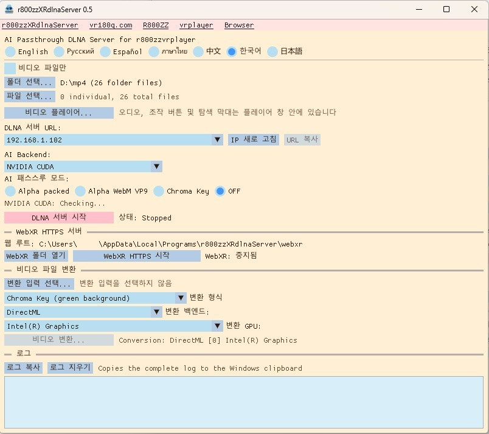

# r800zzXRdlnaServer for Windows

[English](README.md) | [Русский](README_ru.md) | [Español](README_es.md) | [ภาษาไทย](README_th.md) | [中文](README_zh.md) | [한국어](README_ko.md) | [日本語](README_ja.md)

## Ver 0.4 : NVIDIA GPU라도 일부 모델만 지원되던 버그를 수정했습니다.
## Ver 0.4 : DirectML을 통해 NVIDIA 이외의 GPU도 지원하도록 추가했습니다.

PICO, Meta Quest 및 기타 호환 기기에서 XR 비디오를 재생하기 위한 Windows DLNA 서버입니다. 실시간 AI 배경 제거(RVM), alpha/chroma-key 출력 및 비디오 변환을 지원합니다.

**실시간 AI Passthrough를 사용하려면 고성능 GPU가 필요합니다.**

`r800zzXRdlnaServer`는 native C++ 애플리케이션이며 FFmpeg 라이브러리를 직접 사용하고 Python 또는 `ffmpeg.exe`를 실행하지 않습니다.

## 다운로드

https://github.com/r800zz/r800zzxrdlnaserver/releases/latest

<a href="./jpeg/server_ko.jpeg" target="_blank">
  
</a>

### 출력 형식을 지원하는 VR 비디오 플레이어

Green-screen MP4:

- [R800ZZbrowser for PICO/Meta](https://vr180g.com/browser/browser.php?l=kr)
- [r800zzvrplayer for PICO/Meta](https://vr180g.com/pico/vrplayer.php?l=kr)

Alpha Packed:

- [r800zzvrplayer for PICO/Meta](https://vr180g.com/pico/vrplayer.php?l=kr)
- DeoVR (비 VR 비디오는 지원하지 않습니다.)

WebM VP9 Alpha:

- **[r800zzvrplayer 0.6 이상](https://vr180g.com/pico/vrplayer.php?l=kr)**

## AI 모드의 파일 에뮬레이션

실시간 AI 변환은 파일이 아니라 라이브 스트림 형태로 전송됩니다.  
라이브 스트림이므로 별도의 처리가 없다면 비디오의 임의 위치로 탐색할 수 없습니다.  
라이브 스트림에서는 미래의 데이터가 아직 생성되지 않았기 때문에 전체 비디오 길이도 알 수 없습니다.  
탐색할 수 없는 것은 불편합니다.  
비디오 길이를 알 수 없는 것도 불편합니다.  
따라서 r800zzvrplayer는 파일 에뮬레이션을 사용하여 스트림을 일반 파일처럼 처리하고, 탐색 기능과 비디오 길이 표시를 가능하게 합니다.  
이러한 최적화된 파일 에뮬레이션이 가능한 이유는 DLNA 서버와 비디오 플레이어를 동일한 개발자가 개발했기 때문입니다.  
r800zzvrplayer에는 r800zzXRdlnaServer와의 특별한 통신 모드가 있어 두 애플리케이션 사이에서 최적화된 동작이 가능합니다.  
DeoVR에서도 파일 에뮬레이션을 구현했지만, 모든 호환 처리를 서버 측에서 수행해야 하기 때문에 최적화가 더 어렵습니다.  
그 결과 DeoVR에서는 응답 시간이 더 길어집니다.

## 기능

- 선택한 비디오 폴더와 개별 파일을 DLNA로 제공합니다.
- DLNA 미디어 목록에서 원본 파일명을 유지합니다.
- DeoVR을 포함한 호환 클라이언트의 UPnP/DLNA 및 ContentDirectory를 지원합니다.
- Robust Video Matting(RVM)으로 실시간 배경 제거를 수행합니다.
- Alpha Packed, WebM VP9 alpha, green chroma-key 출력을 지원합니다.
- NVIDIA CUDA, DirectML, CPU AI backend를 지원합니다.
- DirectML을 통해 호환되는 AMD, Intel, NVIDIA GPU에서 GPU 처리가 가능합니다.
- GPU 가속 오프라인 변환과 CPU fallback을 지원합니다.
- 오디오, seek, pause/resume, fullscreen, SBS 왼쪽 절반 표시를 지원하는 Windows 비디오 플레이어가 포함됩니다.
- 7개 언어 UI를 제공합니다.
- 설정은 `%LOCALAPPDATA%`에 저장됩니다.

## DLNA 출력 모드

| 모드 | 출력 | 참고 |
| --- | --- | --- |
| Alpha Packed | MPEG-TS의 HEVC | 호환 XR 플레이어용 빠른 실시간 모드 |
| Alpha WebM VP9 | 실제 VP9 alpha WebM | CPU libvpx 인코딩을 사용하며 4K/60에서 프레임이 떨어질 수 있습니다. |
| Chroma Key | 녹색 배경 HEVC | 수신 플레이어에서 green chroma-key를 사용합니다. |
| OFF | 원본 파일 | RVM 처리를 하지 않으며 빠른 GPU가 필요하지 않습니다. |

## 시스템 요구 사항

### 사전 빌드 버전

- Windows 10/11 64-bit
- PC와 재생 기기가 연결된 같은 private LAN
- 호환 DLNA 플레이어
- 실시간 AI에 충분히 빠른 GPU
- 선택한 GPU의 최신 그래픽 드라이버

AI backend:

- **NVIDIA CUDA**: 지원되는 NVIDIA GPU용 최적화 경로
- **DirectML**: 호환 AMD, Intel, NVIDIA GPU용 GPU 경로
- **CPU**: fallback; 실시간 성능은 보장되지 않음

패키지에는 필요한 runtime이 포함되어 있으므로 일반 사용 시 CUDA Toolkit을 별도로 설치할 필요가 없습니다.

NVIDIA CUDA backend는 호환 NVIDIA driver가 필요합니다. DirectML은 해당 GPU를 지원하는 최신 Windows graphics driver를 사용하십시오.

GPU가 충분히 빠르지 않은 경우:

- `OFF` 모드는 정상 사용 가능합니다.
- 오프라인 RVM 변환은 다른 GPU backend 또는 CPU FP32 ONNX model을 사용할 수 있습니다.
- 실시간 AI가 원본 frame rate를 유지하지 못할 수 있습니다.

## 설치

1. **Releases**에서 최신 Windows x64 installer를 다운로드합니다.
2. installer를 실행합니다.
3. `r800zzXRdlnaServer`를 시작합니다.
4. Windows Firewall이 묻는 경우 **Private networks** 접근을 허용합니다.

Installer에는 ONNX Runtime GPU, DirectML, NVIDIA backend용 CUDA/cuDNN, FFmpeg 및 RVM model이 포함됩니다.

## 기본 DLNA 사용

1. 비디오 폴더 및/또는 개별 파일을 선택합니다.
2. backend 선택:
   - **NVIDIA CUDA**
   - **DirectML**
   - **CPU**
3. 출력 모드 선택:
   - **Alpha Packed**
   - **Alpha WebM VP9**
   - **Chroma Key**
   - **OFF**
4. DirectML 사용 시 GPU adapter를 선택합니다.
5. IPv4 주소를 확인합니다.
6. DLNA server를 시작합니다.
7. 같은 LAN에서 호환 플레이어를 엽니다.
8. `r800zzXRdlnaServer`와 비디오를 선택합니다.

## 비디오 변환

지원 형식:

- Chroma-key MP4
- Alpha WebM VP9
- Alpha Packed MP4

```text
movie_RVM_ChromaKey_202609210542.mp4
```

RVM은 선택한 backend와 hardware에 따라 NVIDIA CUDA, DirectML 또는 CPU를 사용할 수 있습니다. NVIDIA CUDA 경로는 가능한 경우 NVDEC/NVENC를 사용합니다. DirectML은 호환되는 NVIDIA 및 비-NVIDIA GPU에서 GPU inference를 실행합니다. CPU도 fallback으로 사용할 수 있습니다.

## 내장 비디오 플레이어

Play/Pause, Seek, 시간 표시, Fullscreen, SBS 왼쪽 절반 표시 및 단축키를 지원합니다.

가능한 경우 NVIDIA NVDEC를 사용하고 필요 시 software decoding으로 fallback합니다. 플레이어 자체 사용에 NVIDIA GPU가 필수는 아닙니다.

## 오디오

- `OFF`는 원본 파일을 그대로 전송합니다.
- Alpha Packed 및 Chroma Key는 AAC를 사용합니다.
- Alpha WebM VP9는 Opus를 사용합니다.
- FFmpeg가 decode할 수 있는 다른 오디오는 transcode할 수 있습니다.
- Multichannel은 stereo로 downmix합니다.

## 소스에서 빌드

### 요구 사항

- Windows 10/11 64-bit
- Visual Studio 2022 + **Desktop development with C++**
- CMake 3.24+
- CUDA backend 컴파일용 NVIDIA CUDA Toolkit 12.8
- Internet

CUDA Toolkit은 NVIDIA CUDA backend의 build dependency입니다. 완성된 앱은 호환 비-NVIDIA GPU에서도 DirectML을 통해 AI 처리를 실행할 수 있습니다.

```bat
setup_dependencies.bat
build.bat
```

생성 파일:

```text
build_cuda_ep\bin\r800zz_dlna_server.exe
build_cuda_ep\bin\r800zz_ai_worker.exe
build_cuda_ep\bin\rvm_mobilenetv3_fp16.onnx
build_cuda_ep\bin\rvm_mobilenetv3_fp32.onnx
```

## 구현

AI backend:

- **NVIDIA CUDA**
- **DirectML**: 호환 AMD, Intel, NVIDIA GPU
- **CPU**

최적화된 NVIDIA 경로:

```text
FFmpeg NVDEC
    -> CUDA preprocessing
    -> ONNX Runtime CUDA EP / RVM
    -> CUDA alpha packing or chroma-key composition
    -> FFmpeg NVENC
    -> MPEG-TS / DLNA
```

DirectML 선택 시 RVM inference는 선택한 호환 GPU에서 DirectML 경로로 실행됩니다. CUDA/NVDEC/NVENC 최적화는 NVIDIA 전용입니다.

WebM VP9 alpha는 CPU `libvpx-vp9` 인코딩을 사용합니다.

## 알려진 제한 사항

- 실시간 AI 성능은 GPU 속도, 해상도, FPS, backend에 크게 좌우됩니다.
- WebM VP9 alpha는 CPU 부하가 높습니다.
- Alpha/chroma-key 지원은 플레이어마다 다릅니다.
- Windows x64를 대상으로 합니다.

## 서드파티 구성요소

- [Robust Video Matting](https://github.com/PeterL1n/RobustVideoMatting)
- [FFmpeg](https://ffmpeg.org/)
- [ONNX Runtime](https://github.com/microsoft/onnxruntime)
- [DirectML](https://github.com/microsoft/DirectML)
- [Dear ImGui](https://github.com/ocornut/imgui)
- [NVIDIA CUDA Toolkit](https://developer.nvidia.com/cuda-toolkit)
- [NVIDIA cuDNN](https://developer.nvidia.com/cudnn)

NVIDIA CUDA/cuDNN은 NVIDIA backend용이며, DirectML 사용에 NVIDIA GPU가 필요하다는 의미가 아닙니다.

## 라이선스

이 프로젝트는 **GNU General Public License v3.0**으로 배포됩니다. [LICENSE](LICENSE)를 참조하십시오.

## 링크

- [vr180g.com](https://vr180g.com/)
- [R800ZZ on YouTube](https://www.youtube.com/@R800ZZ)
