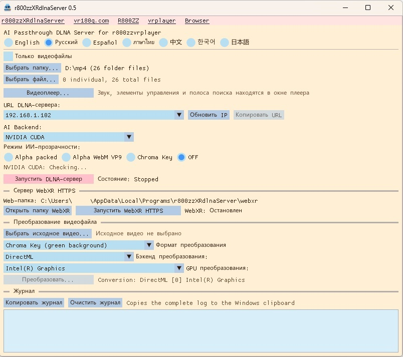
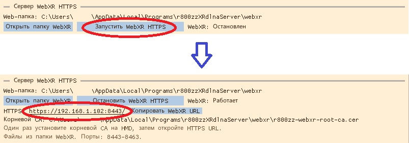
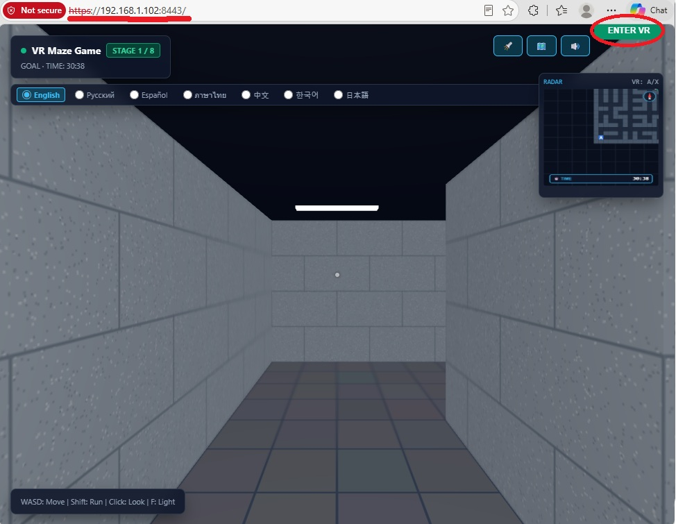

# r800zzXRdlnaServer for Windows

[English](README.md) | [Русский](README_ru.md) | [Español](README_es.md) | [ภาษาไทย](README_th.md) | [中文](README_zh.md) | [한국어](README_ko.md) | [日本語](README_ja.md)

### Ver 0.5 : Добавлен HTTPS-сервер WebXR. (Вы можете играть в WebXR-игры, хранящиеся на вашем ПК.)

DLNA-сервер для Windows для воспроизведения XR-видео на PICO, Meta Quest и других совместимых устройствах. Поддерживает удаление фона в реальном времени с помощью ИИ (RVM), вывод с альфа-каналом/хромакеем и преобразование видео.

**Для работы AI Passthrough в реальном времени требуется быстрый GPU.**

`r800zzXRdlnaServer` — нативное приложение C++. Оно напрямую использует библиотеки FFmpeg и не запускает Python или `ffmpeg.exe`.

## Скачать

https://github.com/r800zz/r800zzxrdlnaserver/releases/latest

<a href="./jpeg/server_ru.jpeg" target="_blank">
  
</a>

### Загружайте файлы, хранящиеся на вашем ПК, из веб-браузера VR-шлема.

<a href="https://vr180g.com/pc2hmd.html?l=ru">Download from r800zzXRdlnaServer</a>


## Сервер WebXR HTTPS

<a href="./jpeg/webxrserver_ru.jpeg" target="_blank">
  
</a>  

<a href="./jpeg/webxr_demo.jpeg" target="_blank">
  
</a>

В Ver 0.5 я добавил HTTPS-сервер.  
Он предназначен для запуска приложений WebXR, хранящихся на вашем ПК.  
WebXR позволяет запускать приложения VR/AR/XR в веб-браузере.  
Если вы хотите создавать собственные VR-приложения и использовать их самостоятельно, WebXR очень удобен.  
Среди множества способов создания VR-приложений WebXR является одним из самых простых.  
Приложение WebXR может работать даже из одного файла с именем `index.html`.  
Однако сложность настройки HTTPS-сервера является одним из главных препятствий для использования WebXR.  
Я сделал HTTPS-сервер, которым любой может легко пользоваться без какой-либо настройки.  
Откройте в веб-браузере URL, например:  
`https://192.168.1.102:8443/`  
URL не является фиксированным. Он может измениться после перезагрузки ПК, Wi-Fi-роутера или другого сетевого оборудования.  
Этот URL работает только в вашей локальной сети и не публикуется в Интернете.  
Если в URL не указано имя файла, сервер загружает `index.html`.  
Например, чтобы открыть `abcd.html`, используйте URL вида:  
`https://192.168.1.102:8443/abcd.html`  
Файлы, такие как `index.html`, хранятся в папке вида:  
`C:\Users\xxxx\AppData\Local\Program\r800zzXRdlnaServer\webxr\`  
Путь к папке отображается в приложении, а саму папку можно открыть нажатием кнопки.  
Если вы новичок, можно просто попросить ИИ:  
`Создай приложение WebXR, используя только один HTML-файл.`  
Ver 0.5 содержит VR-игру-лабиринт в `index.html`.
### Поддерживаемые веб-браузеры
- [R800ZZbrowser Gecko for PICO/Meta](https://vr180g.com/browser/browser.php?l=ru)  
  (R800ZZbrowser Chromium не работает с этим WebXR-сервером.)
- PICO Browser
- Meta Browser
- Веб-браузеры на ПК, такие как Firefox / Chrome / Edge ...  
  (AR обычно не поддерживается. Требуется SteamVR.)

### VR-видеоплееры, поддерживающие выходные форматы

Для MP4 с зелёным фоном примерами VR-плееров с функцией хромакея являются:

- [R800ZZbrowser для PICO/Meta](https://vr180g.com/browser/browser.php?l=ru)
- [r800zzvrplayer для PICO/Meta](https://vr180g.com/pico/vrplayer.php?l=ru)

Для Alpha Packed (формат альфа-видео DeoVR):

- [r800zzvrplayer для PICO/Meta](https://vr180g.com/pico/vrplayer.php?l=ru)
- DeoVR (Видео не в формате VR не поддерживаются.)

Для WebM VP9 Alpha подтверждён следующий VR-плеер:

- **[r800zzvrplayer версии 0.6 или новее](https://vr180g.com/pico/vrplayer.php?l=ru)**

## Эмуляция файла в режиме AI

Преобразование видео с помощью AI в реальном времени передаётся как живой поток, а не как файл.  
Поскольку это живой поток, без специальной обработки невозможно перейти к произвольной позиции видео.  
В живом потоке будущие данные ещё не созданы, поэтому общая продолжительность видео также неизвестна.  
Невозможность перемотки неудобна.  
Неизвестная продолжительность видео также создаёт неудобства.  
Поэтому видеоплеер r800zzvrplayer использует эмуляцию файла, благодаря которой поток обрабатывается как обычный файл, позволяя выполнять перемотку и отображать продолжительность видео.  
Такая оптимизированная эмуляция файла стала возможной благодаря тому, что DLNA-сервер и видеоплеер разработаны одним и тем же разработчиком.  
r800zzvrplayer имеет специальный режим связи с r800zzXRdlnaServer, обеспечивающий оптимизированную работу между двумя приложениями.  
Эмуляция файла также реализована для DeoVR, однако вся совместимость должна обеспечиваться на стороне сервера, поэтому оптимизация значительно сложнее.  
В результате время отклика в DeoVR больше.

## Возможности

- Передача через DLNA видео из выбранной папки и отдельно выбранных видеофайлов.
- Сохранение точного имени исходного файла в списке медиа DLNA.
- Поддержка обнаружения UPnP/DLNA и ContentDirectory для совместимых клиентов, включая DeoVR.
- Удаление фона видео в реальном времени с помощью Robust Video Matting (RVM).
- Поддержка Alpha Packed, настоящего альфа-канала WebM VP9 и зелёного хромакея.
- Поддержка AI-бэкендов NVIDIA CUDA, DirectML и CPU.
- DirectML обеспечивает обработку на совместимых GPU AMD, Intel и NVIDIA.
- Автономное преобразование видео с GPU-ускорением и резервным режимом CPU.
- Встроенный видеоплеер Windows со звуком, перемоткой, паузой/воспроизведением, полноэкранным режимом и показом левой половины SBS.
- Интерфейс на английском, русском, испанском, тайском, китайском, корейском и японском языках.
- Пользовательские настройки сохраняются в `%LOCALAPPDATA%`, а не в каталоге установки.

## Режимы вывода DLNA

| Режим | Вывод | Примечания |
| --- | --- | --- |
| Alpha Packed | HEVC в MPEG-TS | Быстрый режим реального времени для совместимых XR-плееров. |
| Alpha WebM VP9 | WebM с настоящим альфа-каналом VP9 | Использует кодирование libvpx на CPU и может пропускать кадры, особенно для видео 4K/60. |
| Chroma Key | HEVC с зелёным фоном | Используйте режим зелёного хромакея в принимающем плеере. |
| OFF | Исходный файл | RVM не выполняется, быстрый GPU не требуется. |

Интерпретация альфа-канала зависит от принимающего плеера.

## Системные требования

### Готовая сборка

- Windows 10 или Windows 11, 64-разрядная версия
- Частная локальная сеть, общая для ПК Windows и устройства воспроизведения
- Совместимый DLNA-видеоплеер
- Достаточно быстрый GPU для режимов ИИ в реальном времени
- Актуальный графический драйвер для выбранного GPU

Доступные AI-бэкенды:

- **NVIDIA CUDA**: оптимизированный путь для поддерживаемых GPU NVIDIA.
- **DirectML**: GPU-путь для совместимых GPU AMD, Intel и NVIDIA.
- **CPU**: резервный путь; производительность в реальном времени не гарантируется.

Готовый пакет содержит необходимые компоненты среды выполнения. Для обычного использования отдельная установка CUDA Toolkit не требуется.

Для NVIDIA CUDA требуется совместимый драйвер NVIDIA. Для DirectML используйте актуальный графический драйвер Windows, поддерживающий выбранный GPU.

Если выбранный GPU недостаточно быстр для обработки ИИ в реальном времени:

- Обычная передача DLNA остаётся доступной в режиме `OFF`.
- Автономное преобразование RVM может использовать другой GPU-бэкенд или FP32 ONNX-модель через CPU.
- Режимы ИИ в реальном времени могут работать с частотой ниже исходной.

## Установка

1. Скачайте последнюю версию установщика Windows x64 со страницы **Releases**.
2. Запустите установщик.
3. Запустите `r800zzXRdlnaServer`.
4. Если появится запрос брандмауэра Windows, разрешите доступ в **частных сетях**.

Установщик имеет сравнительно большой размер, поскольку включает GPU-поддержку ONNX Runtime, DirectML, CUDA/cuDNN для NVIDIA-бэкенда, библиотеки FFmpeg и модели RVM.

## Основное использование DLNA

1. Выберите папку с помощью **Выбрать папку с видео...**, добавьте отдельные файлы через **Выбрать видеофайл...** или используйте оба способа.
2. Выберите AI-бэкенд:
   - **NVIDIA CUDA**
   - **DirectML**
   - **CPU**
3. Выберите режим вывода:
   - **Alpha Packed**
   - **Alpha WebM VP9**
   - **Chroma Key**
   - **OFF**
4. При использовании DirectML выберите нужный GPU-адаптер.
5. Проверьте публикуемый IPv4-адрес.
6. Выберите **Запустить DLNA-сервер**.
7. Откройте совместимый DLNA-плеер в той же локальной сети.
8. Выберите `r800zzXRdlnaServer` и видео.

## Преобразование видео

Встроенный конвертер может создавать:

- MP4 с хромакеем
- Alpha WebM VP9
- Alpha Packed MP4

Пример предлагаемого имени файла:

```text
movie_RVM_ChromaKey_202609210542.mp4
```

RVM может использовать NVIDIA CUDA, DirectML или CPU в зависимости от выбранного бэкенда и оборудования. Путь NVIDIA CUDA может использовать NVDEC и NVENC, где это применимо. DirectML обеспечивает GPU-инференс на совместимых GPU NVIDIA и других производителей. CPU остаётся резервным вариантом.

## Встроенный видеоплеер

**Видеоплеер...** открывает локальное видео независимо от DLNA.

Элементы управления:

- Воспроизведение/пауза
- Полоса перемотки
- Текущее и общее время
- Полноэкранный режим
- Левая половина SBS
- Space: воспроизведение/пауза
- Стрелки влево/вправо: перемотка на пять секунд
- Escape: выход из полноэкранного режима или закрытие плеера

Если доступен NVIDIA NVDEC для поддерживаемого кодека, плеер пытается использовать его и при необходимости переключается на программное декодирование. NVIDIA GPU не требуется для самого видеоплеера.

## Обработка звука

- `OFF` передаёт исходный файл без изменений.
- Alpha Packed и Chroma Key MPEG-TS используют AAC.
- Alpha WebM VP9 использует Opus.
- Другие форматы звука, декодируемые FFmpeg, могут быть перекодированы.
- Многоканальный звук сводится в стерео; моно остаётся моно.

## Сборка из исходного кода

### Требования

- Windows 10 или Windows 11, 64-разрядная версия
- Visual Studio 2022 с **Разработка классических приложений на C++**
- CMake 3.24 или новее
- NVIDIA CUDA Toolkit 12.8 для компиляции CUDA-бэкенда
- Интернет для загрузки зависимостей

CUDA Toolkit является зависимостью сборки NVIDIA CUDA-бэкенда. Готовое приложение также может выполнять AI-обработку через DirectML на совместимых GPU не от NVIDIA.

### Сборка

```bat
setup_dependencies.bat
build.bat
```

Созданные файлы:

```text
build_cuda_ep\bin\r800zz_dlna_server.exe
build_cuda_ep\bin\r800zz_ai_worker.exe
build_cuda_ep\bin\rvm_mobilenetv3_fp16.onnx
build_cuda_ep\bin\rvm_mobilenetv3_fp32.onnx
```

## Реализация

Доступны три AI-бэкенда:

- **NVIDIA CUDA** для поддерживаемых GPU NVIDIA.
- **DirectML** для совместимых GPU Windows, включая AMD, Intel и NVIDIA.
- **CPU** как резервный вариант совместимости.

Оптимизированный путь NVIDIA:

```text
FFmpeg NVDEC
    -> CUDA preprocessing
    -> ONNX Runtime CUDA EP / RVM
    -> CUDA alpha packing or chroma-key composition
    -> FFmpeg NVENC
    -> MPEG-TS / DLNA
```

При выборе DirectML инференс RVM выполняется через DirectML на выбранном совместимом GPU. CUDA, NVDEC и NVENC остаются оптимизациями только для NVIDIA.

WebM VP9 alpha использует CPU-кодирование `libvpx-vp9`.

## Известные ограничения

- Производительность ИИ в реальном времени сильно зависит от скорости GPU, разрешения, частоты кадров и выбранного бэкенда.
- Кодирование WebM VP9 alpha сильно нагружает CPU.
- Поддержка alpha и chroma-key различается между DLNA/XR-плеерами.
- Приложение предназначено для Windows x64.

## Сторонние компоненты

- [Robust Video Matting](https://github.com/PeterL1n/RobustVideoMatting)
- [FFmpeg](https://ffmpeg.org/)
- [ONNX Runtime](https://github.com/microsoft/onnxruntime)
- [DirectML](https://github.com/microsoft/DirectML)
- [Dear ImGui](https://github.com/ocornut/imgui)
- [NVIDIA CUDA Toolkit](https://developer.nvidia.com/cuda-toolkit)
- [NVIDIA cuDNN](https://developer.nvidia.com/cudnn)

Компоненты NVIDIA CUDA/cuDNN используются NVIDIA-бэкендом и не означают, что для DirectML требуется GPU NVIDIA.

## Лицензия

Проект распространяется по **GNU General Public License v3.0**. См. [LICENSE](LICENSE).

## Ссылки

- [vr180g.com](https://vr180g.com/)
- [R800ZZ на YouTube](https://www.youtube.com/@R800ZZ)
