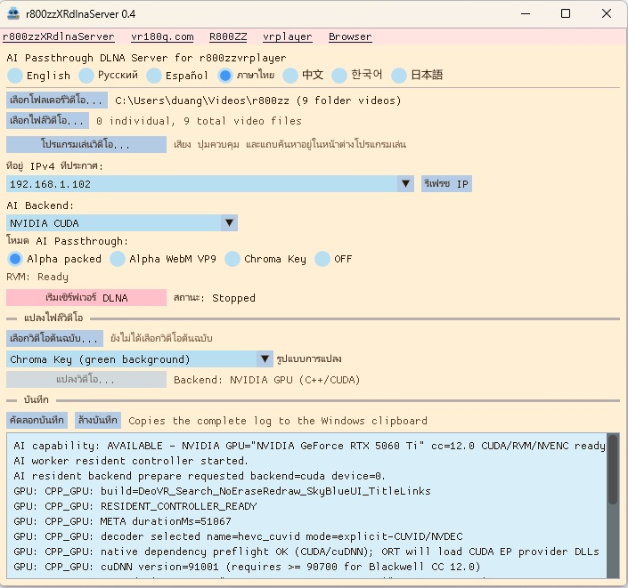

# r800zzXRdlnaServer for Windows

[English](README.md) | [Русский](README_ru.md) | [Español](README_es.md) | [ภาษาไทย](README_th.md) | [中文](README_zh.md) | [한국어](README_ko.md) | [日本語](README_ja.md)

### Ver 0.5 : เพิ่มเซิร์ฟเวอร์ HTTPS สำหรับ WebXR (คุณสามารถเล่นเกม WebXR ที่เก็บไว้ในพีซีได้)
### Ver 0.5 : รองรับการเรียกดูโฟลเดอร์แบบลำดับชั้นใน DLNA
### Ver 0.5 : เพิ่มการเลือก GPU สำหรับการแปลงไฟล์ด้วย AI
### Ver 0.5 : ปรับปรุงการทำงานของ GPU ในโปรแกรมเล่นวิดีโอ
### Ver 0.4 : แก้ไขข้อบกพร่องที่ทำให้รองรับเฉพาะ GPU NVIDIA บางรุ่นเท่านั้น
### Ver 0.4 : เพิ่มการรองรับ GPU ที่ไม่ใช่ NVIDIA ผ่าน DirectML

เซิร์ฟเวอร์ DLNA สำหรับ Windows เพื่อเล่นวิดีโอ XR บน PICO, Meta Quest และอุปกรณ์ที่เข้ากันได้ พร้อมการลบพื้นหลังด้วย AI แบบเรียลไทม์ (RVM), เอาต์พุต alpha/chroma-key และการแปลงวิดีโอ

**ต้องใช้ GPU ที่มีความเร็วสูงสำหรับ AI Passthrough แบบเรียลไทม์**

`r800zzXRdlnaServer` เป็นแอป C++ แบบ native ใช้ไลบรารี FFmpeg โดยตรง และไม่เรียก Python หรือ `ffmpeg.exe`

## ดาวน์โหลด

https://github.com/r800zz/r800zzxrdlnaserver/releases/latest

<a href="./jpeg/server_th.jpeg" target="_blank">
  
</a>

### โปรแกรมเล่นวิดีโอ VR ที่รองรับ

Green-screen MP4:

- [R800ZZbrowser for PICO/Meta](https://vr180g.com/browser/browser.php?l=th)
- [r800zzvrplayer for PICO/Meta](https://vr180g.com/pico/vrplayer.php?l=th)

Alpha Packed:

- [r800zzvrplayer for PICO/Meta](https://vr180g.com/pico/vrplayer.php?l=th)
- DeoVR (ไม่รองรับวิดีโอที่ไม่ใช่ VR)

WebM VP9 Alpha:

- **[r800zzvrplayer 0.6 หรือใหม่กว่า](https://vr180g.com/pico/vrplayer.php?l=th)**

## การจำลองไฟล์ในโหมด AI

การแปลงวิดีโอด้วย AI แบบเรียลไทม์จะส่งเป็นสตรีมสดแทนที่จะเป็นไฟล์  
เนื่องจากเป็นสตรีมสด จึงไม่สามารถเลื่อนไปยังตำแหน่งใดก็ได้ของวิดีโอหากไม่มีการจัดการเพิ่มเติม  
ในสตรีมสด ข้อมูลในอนาคตยังไม่ได้ถูกสร้างขึ้น ดังนั้นความยาวทั้งหมดของวิดีโอก็ยังไม่สามารถทราบได้  
การไม่สามารถเลื่อนตำแหน่งวิดีโอได้ทำให้ใช้งานไม่สะดวก  
การไม่ทราบความยาวของวิดีโอก็ทำให้ใช้งานไม่สะดวกเช่นกัน  
ด้วยเหตุนี้ r800zzvrplayer จึงใช้การจำลองไฟล์ เพื่อให้สตรีมสามารถทำงานเหมือนไฟล์วิดีโอปกติ สามารถเลื่อนตำแหน่งและแสดงความยาวของวิดีโอได้  
การจำลองไฟล์ที่ได้รับการปรับแต่งนี้เป็นไปได้เนื่องจาก DLNA Server และโปรแกรมเล่นวิดีโอได้รับการพัฒนาโดยนักพัฒนาคนเดียวกัน  
r800zzvrplayer มีโหมดการสื่อสารพิเศษกับ r800zzXRdlnaServer ทำให้ทั้งสองแอปพลิเคชันสามารถทำงานร่วมกันได้อย่างเหมาะสม  
มีการรองรับการจำลองไฟล์สำหรับ DeoVR เช่นกัน แต่เนื่องจากการรองรับทั้งหมดต้องดำเนินการจากฝั่งเซิร์ฟเวอร์ จึงปรับแต่งการทำงานได้ยากกว่า  
ดังนั้นเวลาในการตอบสนองของ DeoVR จึงนานกว่า

## คุณสมบัติ

- ส่งโฟลเดอร์วิดีโอและไฟล์ที่เลือกผ่าน DLNA
- เก็บชื่อไฟล์ต้นฉบับในรายการ DLNA
- รองรับ UPnP/DLNA และ ContentDirectory รวมถึง DeoVR
- ลบพื้นหลังแบบเรียลไทม์ด้วย Robust Video Matting (RVM)
- รองรับ Alpha Packed, WebM VP9 alpha และ green chroma-key
- รองรับ AI backend: NVIDIA CUDA, DirectML และ CPU
- DirectML ใช้ GPU ที่เข้ากันได้จาก AMD, Intel และ NVIDIA
- รองรับการแปลงวิดีโอแบบออฟไลน์ด้วย GPU และ fallback ไป CPU
- มีโปรแกรมเล่นวิดีโอ Windows พร้อมเสียง seek pause/resume fullscreen และ SBS ครึ่งซ้าย
- UI 7 ภาษา
- บันทึกการตั้งค่าใน `%LOCALAPPDATA%`

## โหมดเอาต์พุต DLNA

| โหมด | เอาต์พุต | หมายเหตุ |
| --- | --- | --- |
| Alpha Packed | HEVC ใน MPEG-TS | โหมดเรียลไทม์ความเร็วสูง |
| Alpha WebM VP9 | WebM พร้อม VP9 alpha | ใช้ libvpx บน CPU และอาจตกเฟรม โดยเฉพาะ 4K/60 |
| Chroma Key | HEVC พร้อมพื้นหลังสีเขียว | ใช้โหมด green chroma-key ที่ฝั่ง player |
| OFF | ไฟล์ต้นฉบับ | ไม่ใช้ RVM และไม่ต้องใช้ GPU ความเร็วสูง |

## ความต้องการของระบบ

### รุ่นสำเร็จรูป

- Windows 10 หรือ Windows 11 64-bit
- เครือข่าย LAN ส่วนตัวร่วมกัน
- DLNA player ที่เข้ากันได้
- GPU ที่เร็วเพียงพอสำหรับ AI แบบเรียลไทม์
- ไดรเวอร์กราฟิกล่าสุดสำหรับ GPU ที่เลือก

AI backend:

- **NVIDIA CUDA**: เส้นทางที่ปรับแต่งสำหรับ NVIDIA GPU ที่รองรับ
- **DirectML**: เส้นทาง GPU สำหรับ AMD, Intel และ NVIDIA ที่รองรับ
- **CPU**: fallback; ไม่รับประกันความเร็วแบบเรียลไทม์

แพ็กเกจมี runtime ที่จำเป็นอยู่แล้ว ไม่ต้องติดตั้ง CUDA Toolkit แยกสำหรับการใช้งานปกติ

NVIDIA CUDA ต้องใช้ไดรเวอร์ NVIDIA ที่รองรับ ส่วน DirectML ให้ใช้ไดรเวอร์ Windows ล่าสุดที่รองรับ GPU

หาก GPU ไม่เร็วพอ:

- ใช้ `OFF` ได้ตามปกติ
- การแปลง RVM แบบออฟไลน์ใช้ GPU backend อื่นหรือ CPU ได้
- AI แบบเรียลไทม์อาจทำ FPS ไม่ถึงต้นฉบับ

## การติดตั้ง

1. ดาวน์โหลด Windows x64 installer ล่าสุดจาก **Releases**
2. รัน installer
3. เปิด `r800zzXRdlnaServer`
4. อนุญาต Private networks หาก Windows Firewall ถาม

Installer มี ONNX Runtime GPU, DirectML, CUDA/cuDNN สำหรับ NVIDIA backend, FFmpeg และ RVM models

## การใช้งาน DLNA

1. เลือกโฟลเดอร์และ/หรือไฟล์วิดีโอ
2. เลือก backend:
   - **NVIDIA CUDA**
   - **DirectML**
   - **CPU**
3. เลือก output:
   - **Alpha Packed**
   - **Alpha WebM VP9**
   - **Chroma Key**
   - **OFF**
4. หากใช้ DirectML ให้เลือก GPU adapter
5. ตรวจสอบ IPv4
6. เริ่ม DLNA server
7. เปิด DLNA player ใน LAN เดียวกัน
8. เลือก `r800zzXRdlnaServer` และวิดีโอ

## การแปลงวิดีโอ

รองรับ:

- Chroma-key MP4
- Alpha WebM VP9
- Alpha Packed MP4

```text
movie_RVM_ChromaKey_202609210542.mp4
```

RVM ใช้ NVIDIA CUDA, DirectML หรือ CPU ตาม backend และฮาร์ดแวร์ที่เลือก เส้นทาง NVIDIA CUDA สามารถใช้ NVDEC/NVENC ได้เมื่อเหมาะสม DirectML ใช้ GPU inference บน GPU ที่รองรับทั้ง NVIDIA และผู้ผลิตอื่น ส่วน CPU เป็น fallback

## โปรแกรมเล่นวิดีโอ

รองรับ Play/Pause, Seek, เวลา, Fullscreen, SBS ครึ่งซ้าย และคีย์ลัด

หากใช้ได้ โปรแกรมจะลอง NVIDIA NVDEC สำหรับ codec ที่รองรับ และ fallback ไป software decoding เมื่อจำเป็น ไม่จำเป็นต้องมี NVIDIA GPU เพื่อใช้ player

## เสียง

- `OFF` ส่งไฟล์ต้นฉบับ
- Alpha Packed และ Chroma Key ใช้ AAC
- Alpha WebM VP9 ใช้ Opus
- เสียงอื่นที่ FFmpeg decode ได้สามารถ transcode
- Multichannel downmix เป็น stereo

## การ build จาก source

### Requirements

- Windows 10/11 64-bit
- Visual Studio 2022 พร้อม **Desktop development with C++**
- CMake 3.24+
- NVIDIA CUDA Toolkit 12.8 สำหรับ compile CUDA backend
- Internet

CUDA Toolkit เป็น build dependency ของ NVIDIA CUDA backend แต่แอปที่ build แล้วสามารถใช้ DirectML บน GPU ที่ไม่ใช่ NVIDIA ได้

```bat
setup_dependencies.bat
build.bat
```

ไฟล์ที่สร้าง:

```text
build_cuda_ep\bin\r800zz_dlna_server.exe
build_cuda_ep\bin\r800zz_ai_worker.exe
build_cuda_ep\bin\rvm_mobilenetv3_fp16.onnx
build_cuda_ep\bin\rvm_mobilenetv3_fp32.onnx
```

## การทำงานภายใน

AI backend:

- **NVIDIA CUDA**
- **DirectML** สำหรับ AMD, Intel, NVIDIA ที่รองรับ
- **CPU**

เส้นทาง NVIDIA:

```text
FFmpeg NVDEC
    -> CUDA preprocessing
    -> ONNX Runtime CUDA EP / RVM
    -> CUDA alpha packing or chroma-key composition
    -> FFmpeg NVENC
    -> MPEG-TS / DLNA
```

DirectML รัน RVM inference บน GPU ที่เลือก ส่วน CUDA/NVDEC/NVENC เป็นการปรับแต่งเฉพาะ NVIDIA

WebM VP9 alpha ใช้ `libvpx-vp9` บน CPU

## ข้อจำกัด

- ความเร็ว AI แบบเรียลไทม์ขึ้นกับ GPU, ความละเอียด, FPS และ backend
- WebM VP9 alpha ใช้ CPU สูง
- การรองรับ alpha/chroma-key ต่างกันตาม player
- รองรับ Windows x64

## Third-Party Components

- [Robust Video Matting](https://github.com/PeterL1n/RobustVideoMatting)
- [FFmpeg](https://ffmpeg.org/)
- [ONNX Runtime](https://github.com/microsoft/onnxruntime)
- [DirectML](https://github.com/microsoft/DirectML)
- [Dear ImGui](https://github.com/ocornut/imgui)
- [NVIDIA CUDA Toolkit](https://developer.nvidia.com/cuda-toolkit)
- [NVIDIA cuDNN](https://developer.nvidia.com/cudnn)

CUDA/cuDNN ใช้กับ NVIDIA backend และไม่ได้หมายความว่า DirectML ต้องใช้ NVIDIA GPU

## License

โครงการนี้ใช้ **GNU General Public License v3.0** ดู [LICENSE](LICENSE)

## Links

- [vr180g.com](https://vr180g.com/)
- [R800ZZ on YouTube](https://www.youtube.com/@R800ZZ)
