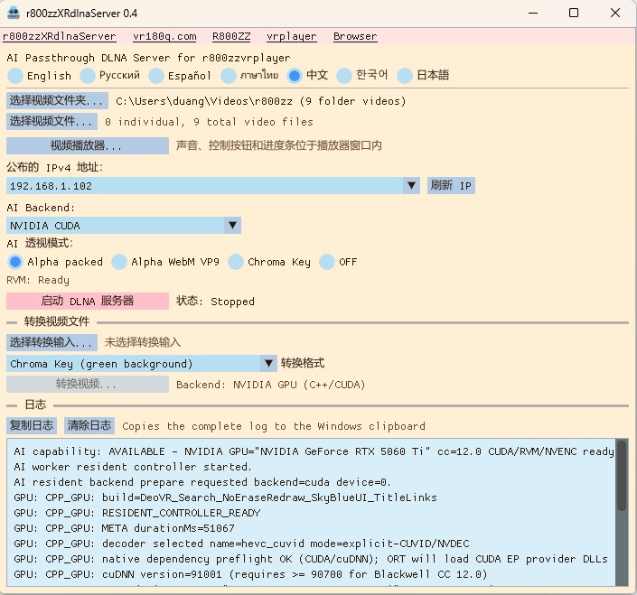

# r800zzXRdlnaServer for Windows

[English](README.md) | [Русский](README_ru.md) | [Español](README_es.md) | [ภาษาไทย](README_th.md) | [中文](README_zh.md) | [한국어](README_ko.md) | [日本語](README_ja.md)

### Ver 0.5 : 添加了 WebXR HTTPS 服务器。（可以运行存储在 PC 上的 WebXR 游戏。）
### Ver 0.5 : DLNA 支持分层目录浏览。
### Ver 0.5 : AI 文件转换支持选择 GPU。
### Ver 0.5 : 改进了视频播放器的 GPU 处理。
### Ver 0.4 : 修复了即使是 NVIDIA GPU 也仅支持部分型号的问题。
### Ver 0.4 : 通过 DirectML 增加了对非 NVIDIA GPU 的支持。

用于 PICO、Meta Quest 和其他兼容设备上播放 XR 视频的 Windows DLNA 服务器，支持实时 AI 背景移除（RVM）、Alpha/色键输出和视频转换。

**实时 AI Passthrough 需要高性能 GPU。**

`r800zzXRdlnaServer` 是原生 C++ 应用程序，直接使用 FFmpeg 库，不会启动 Python 或 `ffmpeg.exe`。

## 下载

https://github.com/r800zz/r800zzxrdlnaserver/releases/latest

<a href="./jpeg/server_zh.jpeg" target="_blank">
  
</a>

### 支持输出格式的 VR 视频播放器

Green-screen MP4:

- [R800ZZbrowser for PICO/Meta](https://vr180g.com/browser/browser.php?l=cn)
- [r800zzvrplayer for PICO/Meta](https://vr180g.com/pico/vrplayer.php?l=cn)

Alpha Packed:

- [r800zzvrplayer for PICO/Meta](https://vr180g.com/pico/vrplayer.php?l=cn)
- DeoVR（不支持非 VR 视频。）

WebM VP9 Alpha:

- **[r800zzvrplayer 0.6 或更高版本](https://vr180g.com/pico/vrplayer.php?l=cn)**

## AI 模式下的文件模拟

实时 AI 转换并不是作为文件提供，而是以实时流的形式传输。  
由于它是实时流，如果不进行特殊处理，就无法跳转到视频中的任意位置。  
对于实时流，未来的数据尚未生成，因此视频的总时长也无法确定。  
无法进行跳转会带来不便。  
无法知道视频总时长同样会带来不便。  
因此，r800zzvrplayer 视频播放器使用文件模拟，使实时流能够像普通文件一样处理，从而可以进行跳转并显示视频时长。  
之所以能够实现这种经过优化的文件模拟，是因为 DLNA 服务器和视频播放器由同一位开发者开发。  
r800zzvrplayer 与 r800zzXRdlnaServer 之间具有特殊的通信模式，因此可以在两个应用程序之间实现优化的操作。  
DeoVR 也实现了文件模拟，但由于所有兼容处理都必须由服务器端完成，因此优化更加困难。  
因此，DeoVR 的响应时间会更长。

## 功能

- 通过 DLNA 提供所选视频文件夹和单独选择的视频文件。
- 在 DLNA 媒体列表中保留原始文件名。
- 支持 UPnP/DLNA discovery 和 ContentDirectory，包括 DeoVR。
- 使用 Robust Video Matting（RVM）实时移除视频背景。
- 支持 Alpha Packed、真正的 WebM VP9 alpha 和绿色色键输出。
- 支持 NVIDIA CUDA、DirectML 和 CPU 三种 AI 后端。
- DirectML 可在兼容的 AMD、Intel 和 NVIDIA GPU 上进行 GPU 处理。
- 支持 GPU 加速的离线视频转换，并可回退到 CPU。
- 内置 Windows 视频播放器，支持声音、拖动、暂停/继续、全屏和 SBS 左半画面。
- 提供 7 种语言界面。
- 用户设置保存在 `%LOCALAPPDATA%`。

## DLNA 输出模式

| 模式 | 输出 | 说明 |
| --- | --- | --- |
| Alpha Packed | MPEG-TS 中的 HEVC | 适用于兼容 XR 播放器的高速实时模式。 |
| Alpha WebM VP9 | 带真正 VP9 alpha 的 WebM | 使用 CPU libvpx 编码，特别是 4K/60 视频可能掉帧。 |
| Chroma Key | 绿色背景 HEVC | 在接收播放器中使用绿色色键模式。 |
| OFF | 原始文件 | 不进行 RVM，无需高速 GPU。 |

## 系统要求

### 预编译版本

- Windows 10 或 Windows 11 64 位
- Windows PC 与播放设备位于同一私有局域网
- 兼容的 DLNA 视频播放器
- 实时 AI 模式需要足够快的 GPU
- 所选 GPU 的最新图形驱动

可用 AI 后端:

- **NVIDIA CUDA**：面向兼容 NVIDIA GPU 的优化路径。
- **DirectML**：面向兼容 AMD、Intel 和 NVIDIA GPU 的 GPU 路径。
- **CPU**：后备路径，不保证实时性能。

预编译包已包含应用所需运行库，正常使用无需单独安装 CUDA Toolkit。

NVIDIA CUDA 后端需要兼容的 NVIDIA 驱动。DirectML 请使用支持该 GPU 的最新 Windows 图形驱动。

如果 GPU 性能不足:

- `OFF` 模式仍可正常使用。
- 离线 RVM 转换可使用其他 GPU 后端或 CPU FP32 ONNX 模型。
- 实时 AI 模式可能无法维持原始帧率。

## 安装

1. 从 **Releases** 下载最新 Windows x64 安装程序。
2. 运行安装程序。
3. 启动 `r800zzXRdlnaServer`。
4. Windows Firewall 询问时允许 **Private networks**。

安装程序包含 ONNX Runtime GPU 支持、DirectML、NVIDIA 后端所需 CUDA/cuDNN、FFmpeg 和 RVM 模型。

## 基本 DLNA 使用

1. 选择视频文件夹和/或单独文件。
2. 选择 AI 后端:
   - **NVIDIA CUDA**
   - **DirectML**
   - **CPU**
3. 选择输出模式:
   - **Alpha Packed**
   - **Alpha WebM VP9**
   - **Chroma Key**
   - **OFF**
4. 使用 DirectML 时选择 GPU adapter。
5. 确认 IPv4 地址。
6. 启动 DLNA Server。
7. 在同一 LAN 打开兼容播放器。
8. 选择 `r800zzXRdlnaServer` 和视频。

## 视频转换

可创建:

- Chroma-key MP4
- Alpha WebM VP9
- Alpha Packed MP4

```text
movie_RVM_ChromaKey_202609210542.mp4
```

RVM 可根据所选后端和硬件使用 NVIDIA CUDA、DirectML 或 CPU。NVIDIA CUDA 路径在适用时可使用 NVDEC/NVENC。DirectML 可在兼容的 NVIDIA 和非 NVIDIA GPU 上运行 GPU 推理。CPU 仍可作为后备。

## 内置视频播放器

支持 Play/Pause、Seek、当前/总时间、Fullscreen、SBS 左半画面和快捷键。

在可用时播放器会尝试 NVIDIA NVDEC，并在必要时回退到软件解码。使用播放器本身不要求 NVIDIA GPU。

## 音频

- `OFF` 发送原始文件。
- Alpha Packed 和 Chroma Key 使用 AAC。
- Alpha WebM VP9 使用 Opus。
- FFmpeg 可解码的其他音频可按需转码。
- 多声道输入下混为立体声。

## 从源代码构建

### 要求

- Windows 10/11 64 位
- Visual Studio 2022 + **Desktop development with C++**
- CMake 3.24+
- 用于编译 CUDA 后端的 NVIDIA CUDA Toolkit 12.8
- Internet

CUDA Toolkit 是 NVIDIA CUDA 后端的构建依赖。构建完成的程序也可以通过 DirectML 在兼容的非 NVIDIA GPU 上运行 AI。

```bat
setup_dependencies.bat
build.bat
```

生成文件:

```text
build_cuda_ep\bin\r800zz_dlna_server.exe
build_cuda_ep\bin\r800zz_ai_worker.exe
build_cuda_ep\bin\rvm_mobilenetv3_fp16.onnx
build_cuda_ep\bin\rvm_mobilenetv3_fp32.onnx
```

## 实现

AI 后端:

- **NVIDIA CUDA**
- **DirectML**：兼容 AMD、Intel、NVIDIA GPU
- **CPU**

优化后的 NVIDIA 路径:

```text
FFmpeg NVDEC
    -> CUDA preprocessing
    -> ONNX Runtime CUDA EP / RVM
    -> CUDA alpha packing or chroma-key composition
    -> FFmpeg NVENC
    -> MPEG-TS / DLNA
```

选择 DirectML 时，RVM 推理通过 DirectML 在所选兼容 GPU 上运行。CUDA、NVDEC、NVENC 优化仍仅属于 NVIDIA。

WebM VP9 alpha 使用 CPU `libvpx-vp9` 编码。

## 已知限制

- 实时 AI 性能高度依赖 GPU 速度、分辨率、帧率和后端。
- WebM VP9 alpha 编码 CPU 占用较高。
- Alpha/色键支持因 DLNA/XR 播放器而异。
- 当前目标平台为 Windows x64。

## 第三方组件

- [Robust Video Matting](https://github.com/PeterL1n/RobustVideoMatting)
- [FFmpeg](https://ffmpeg.org/)
- [ONNX Runtime](https://github.com/microsoft/onnxruntime)
- [DirectML](https://github.com/microsoft/DirectML)
- [Dear ImGui](https://github.com/ocornut/imgui)
- [NVIDIA CUDA Toolkit](https://developer.nvidia.com/cuda-toolkit)
- [NVIDIA cuDNN](https://developer.nvidia.com/cudnn)

NVIDIA CUDA/cuDNN 用于 NVIDIA 后端，并不表示 DirectML 后端必须使用 NVIDIA GPU。

## 许可证

本项目使用 **GNU General Public License v3.0**。参见 [LICENSE](LICENSE)。

## 链接

- [vr180g.com](https://vr180g.com/)
- [R800ZZ on YouTube](https://www.youtube.com/@R800ZZ)
